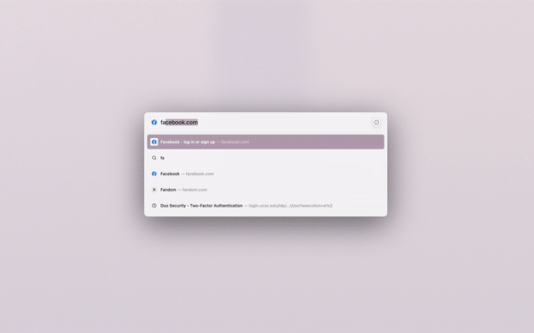

# Intentional Surfing

Fully inspired by [Mindful Media Boost](https://github.com/qu8n/arc-boost-mindful-media#mindful-media-boost) by **[quanvs](https://github.com/quanvs/arc-boost-mindful-media)**

This a Boost for the [Arc browser](https://arc.net/) modified the original rise and fall box design of the Mindful Media Boost into a pulsing circle that imitates exhalations and inhalations. Along with the countdown timer, the boost encourages you to write down your intention for entering a website. This added feature was designed with the hope to help us be more intentional and mindful with internet-surfing. 

## Tested Websites to Date

- Facebook
- Twitter
- Youtube
- Pinterest
- Netflix
- eBay
